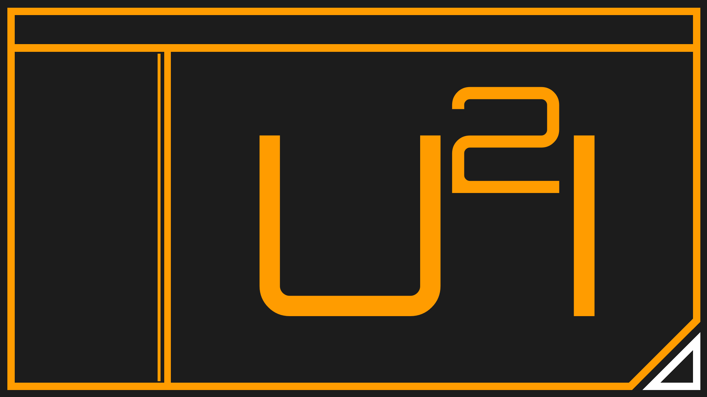
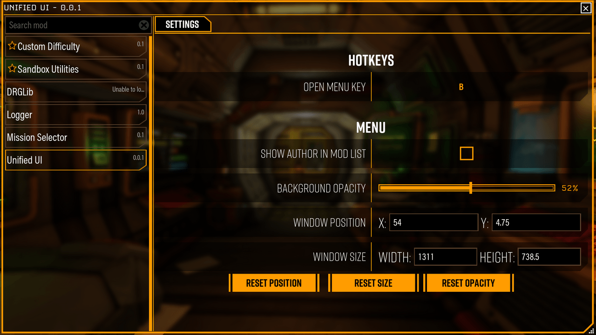
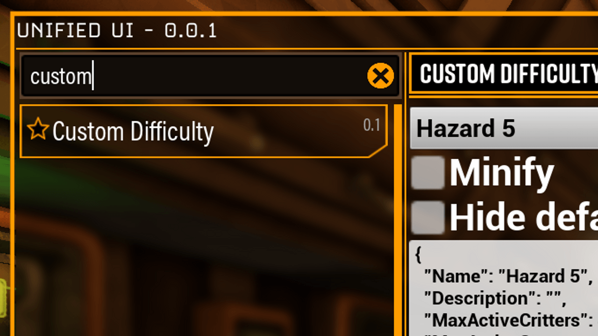

# Unified UI
<p float="left">
  
  
  
</p>

An in game mod settings menu for Deep Rock Galactic.

## Install
1. Download [latest release](https://github.com/trumank/drg-unified-ui/releases/latest)
2. Drag and drop file into [mint](https://github.com/trumank/mint)

## Usage
Press key bind (`B` by default) in game to open menu.

## For modders

The set of supported functions is as follows:

```
IHub:
- SetOpacity
- SelectPage
- Close Hub
- Open Hub

IHubMod:
- ModRegistered
- ModHubClosed
- ModHubOpened
- GetModPages
- GetModInfo

IHubPageWidget:
- HubPageClosed
- HubPageOpened
- GetContainerMode
- GetPageInfo
```
